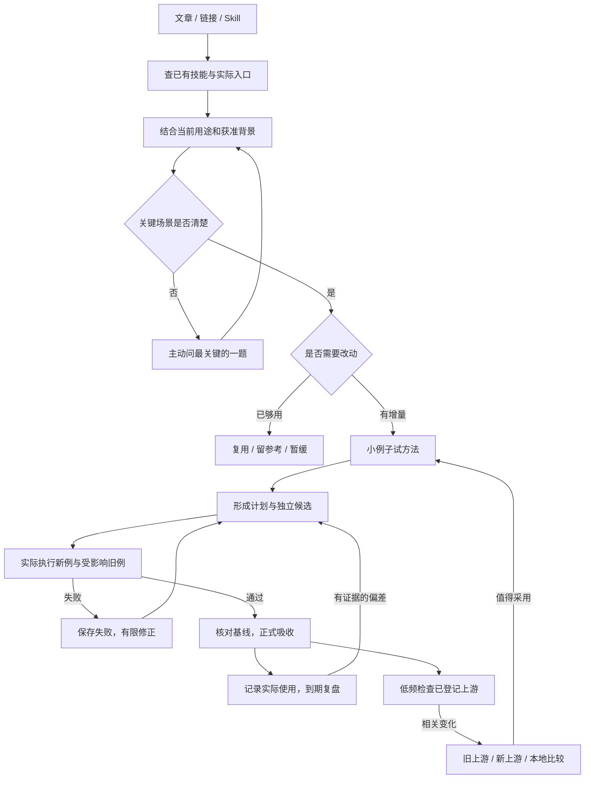

# 萝卜叔叔的 AI 技能库 · luobo-skills

面向学习、调研、写作与知识工作的实用 AI 技能集合。第一个作品是 **魂环猎手**；后续技能经过整理和验证后再加入。

## 魂环猎手 · Soul Ring Hunter

早期名称为“魂环猎者”；技能标识和调用入口保持 `soul-ring-hunter`。当前显示名采用“魂环猎手”。

**先看自己有什么、需要什么，再把外部方法变成经过验证的能力。**

一篇文章、一个链接、一个外部 Skill，都可以是输入。最后可能升级一个技能，也可能发现已有能力足够，直接复用。

当前为 `0.1.1-alpha.1` 本地公开试用候选；已有四次明确登记的真实素材任务，完整需求仍在逐项验收。本仓库按 MIT 许可证分享；这是早期试用版本，GitHub Release 创建情况以 Releases 页面为准。



## 从这里开始

入口是 [`skills/soul-ring-hunter/SKILL.md`](skills/soul-ring-hunter/SKILL.md)。让支持 Skill 的代理读取它；需要常驻时，将完整 `soul-ring-hunter` 文件夹放到当前宿主实际发现的技能目录。不要把整个本项目当成一个待替换的生效技能目录。

在 Codex 中可以明确说：

> 用 $soul-ring-hunter 吸收这份材料。我想把它用在每周的阅读笔记中；先检查现有能力，保留我的输出格式，值得就改造并自己跑一个例子。

用途尚不清楚也可以直接给材料，它应先盘点，再问决定方向的最小问题。已有相关背景时只读获准、真正影响判断的部分；可明确说“这次不要读取历史”。

普通文章摘要不需要这个 Skill。已经存在同样能力时，它也不该为了显示工作量再创建一个。

## 为什么要做它

安装现成技能容易，判断它是否适合自己的工作、是否重复、改完是否保住旧能力更难。魂环猎手把这些判断接成一条可回查的流程：

- **盘点在先**：比较任务与输入输出，名称相似不直接合并。
- **为使用者改造**：当前要求优先；缺少关键场景才提问。
- **两次验证**：计划前试方法，改好后实际跑候选。
- **可恢复应用**：保存基线与证据，拒绝覆盖后续改动。
- **有证据再迭代**：真实使用和开发回放分开，无数据不凑改进。
- **上游更新有人管**：只查登记路径，保留本地改造；发现更新后仍经过试验与验收。

它复用宿主已有的读取、搜索、记忆与执行工具，没有专用服务器、账号、向量库或跨模型调度框架。

## 一个小例子

已有技能能把短文整理成 `summary`、`points`、`source` 三字段 JSON。新文章介绍段落引用，并建议增加一个字段。

使用者仍需要原来的三字段。正确结果是：改造原入口，把引用放在原句末尾；保留事实、条件和未知；用当前例及旧例验证后再应用。不是照抄新字段，也不是再装一个同用途技能。

本例的有技能组和普通提示对照组都生成了合格笔记。当前观察到的差别主要是流程和证据更完整；不能据此宣称笔记更准确、更快或更省 token。详见 [实际验证与边界](TESTING.md)。

## 从真实材料中留下了什么

已处理 Grill Me 提问方法、Obsidian 六技能文章、LLM Wiki 流水线文章，以及两张去 AI 味榜单。结果包括复用、参考、适配新技能和更新已有写作规则；不是四次同题对照。

例如，改稿规则不能把无来源的“提升80%”改装成“通常明显提升”或凭空增加个人体感。先区分表达问题与证据缺口，改完再逐句核对原意。这个80%是合成测试输入，不是真实收益。

完整取舍、失败修正及可复用做法见 [四次实测经验](LESSONS.md)。准备公开的版本说明见 [试用说明草稿](RELEASE-NOTES.md)。

## 目录与依赖

```text
skills/soul-ring-hunter/
  SKILL.md                 工作流程与触发条件
  agents/openai.yaml       Codex 显示信息
  references/              宿主、记录、操作恢复和复盘说明
  scripts/skill_ops.py      盘点、指纹、冻结、应用、回退
  scripts/followup.py       明确登记的使用记录与到期检查
  scripts/upstream.py       公开 GitHub 相关路径的版本检查
tests/                     文件安全测试与行为案例说明
examples/                  可复现的合成输入与准备方式
```

三个脚本仅使用 Python 3 标准库；upstream.py 访问公开 GitHub 元数据，其他两个脚本离线。当前在 macOS / Python 3.14.4 实跑。能阅读通用 Skill 格式不等于具备执行、记忆或调度能力；其他宿主需单独验收。没有调用 Claude、Kimi 或 DeepSeek。

运行确定性测试：

```sh
python3 -B -m unittest discover -s tests -v
```

运行记录、个人输入和事务备份放在包外。应用工具只处理一个普通技能目录；遇 `.git` 元数据、软链接或基线变化会拒绝替换。细节见 [操作与恢复](skills/soul-ring-hunter/references/operations.md)。

## 当前进度

可开始在已验证环境试用；自然触发、更多输入场景、其他模型/宿主和长期收益仍需真实样本。复盘当前支持主动登记使用和下次调用检查，默认没有全局后台监听。

后续继续积累可比任务的真实反馈，再补相应测试和适配。试用前请阅读 [MIT 许可证](LICENSE)、[作者与来源](NOTICE.md) 以及测试边界。当前四次任务不能证明长期收益；此目录只保留脱敏经验和合成输入，没有纳入私人运行记录或第三方 Skill 全文。


## 作者与开源许可

由 **萝卜叔叔（kelvincjf）** 整理开发，按 [MIT License](LICENSE) 开源。允许使用、修改、分发及商用，须按许可证保留版权和许可声明。原始仓库：[kelvincjf/luobo-skills](https://github.com/kelvincjf/luobo-skills)。来源标记及第三方方法说明见 [NOTICE.md](NOTICE.md)。
