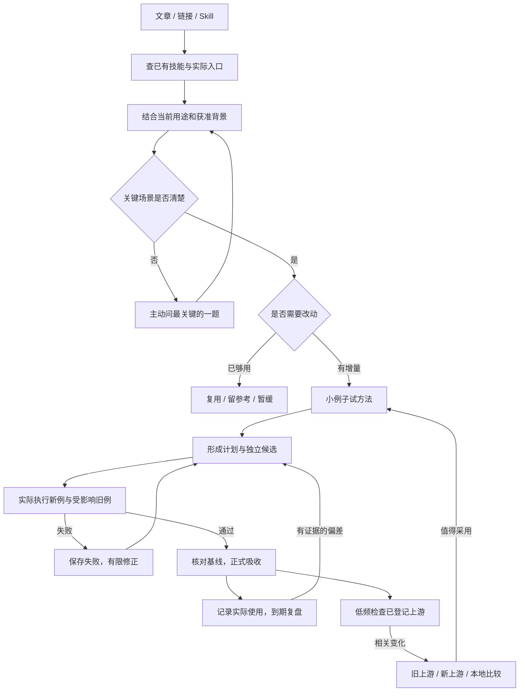

# 萝卜叔叔的 AI 技能库 · luobo-skills

面向学习、调研、写作与知识工作的实用 AI 技能集合。第一个作品是 **萝卜·魂环猎手**；后续技能经过整理和验证后再加入。

## 萝卜·逻辑写作 · Luobo Clear Writing

[技能入口](skills/luobo-clear-writing/SKILL.md) · [使用与集成](skills/luobo-clear-writing/README.md)

先组织读者能跟上的主线，再写文章、拆图卡。流程按时间或依赖，系统按组成与交接，比较按统一标准；用金字塔原理检查支撑，用MECE检查同层分类，先检查是否讲得通，再检查版面。

可作为既有写作、配图与小红书流程的共同子技能。保留本人风格和定稿，不把所有选题都套成三段。当前0.1.0，有限隔离回放及未测边界见包内validation；没有真实读者理解率或Token收益测量。

## 萝卜·魂环猎手 · Luobo Soul Ring Hunter

早期名称为“魂环猎者”，之后称“魂环猎手”。现在加上自己的品牌前缀：中文名 **萝卜·魂环猎手**，新安装入口为 `luobo-soul-ring-hunter`。旧版 `soul-ring-hunter` 目录暂时保留兼容原有链接和调用；两者选一个安装即可。

**先看自己有什么、需要什么，再把外部方法变成经过验证的能力。**

一篇文章、一个链接、一个外部 Skill，都可以是输入。最后可能升级一个技能，也可能发现已有能力足够，直接复用。

当前为 `0.1.1-alpha.1` 本地公开试用候选；已有四次明确登记的真实素材任务，完整需求仍在逐项验收。本仓库按 MIT 许可证分享；这是早期试用版本，GitHub Release 创建情况以 Releases 页面为准。



## 为什么叫“萝卜·魂环猎手”

取名有点中二。“魂环”让我想到《斗罗大陆》，而不断吸收能力这个设想，也让我联想到《犬夜叉》里的奈落——吸收妖怪的力量，让自己变强。名字里的“萝卜”，是我自己的品牌标记。奈落相关情节可参见[动画官方第81话介绍](https://www.ytv.co.jp/inuyasha/story/2000_story/04.html)。

我也想让自己的 AI 系统不断吸收、迭代：看到一个好方法，先弄清自己需不需要，再把适合的部分改成能用的能力。这就是我做“萝卜·魂环猎手”的初衷。

## 从这里开始

入口是 [`skills/luobo-soul-ring-hunter/SKILL.md`](skills/luobo-soul-ring-hunter/SKILL.md)。让支持 Skill 的代理读取它；需要常驻时，将完整 `luobo-soul-ring-hunter` 文件夹放到当前宿主实际发现的技能目录。不要把整个本项目当成一个待替换的生效技能目录。

在 Codex 中可以明确说：

> 用 $luobo-soul-ring-hunter 吸收这份材料。我想把它用在每周的阅读笔记中；先检查现有能力，保留我的输出格式，值得就改造并自己跑一个例子。

用途尚不清楚也可以直接给材料，它应先盘点，再问决定方向的最小问题。已有相关背景时只读获准、真正影响判断的部分；可明确说“这次不要读取历史”。

普通文章摘要不需要这个 Skill。已经存在同样能力时，它也不该为了显示工作量再创建一个。

## 为什么要做它

以前学 Python，我会用现成的库；读研用 MATLAB 时也是这样。到了 AI 时代，更没必要事事从头做一遍。GitHub 上成熟的 Skill，公众号、小红书里发现的好方法，都值得参考。

但把它们用进自己的系统前，我通常需要想清楚四件事：

1. 我已经有类似的 Skill 了吗？
2. 它适合我的场景、习惯和系统吗？
3. 有没有更合适的同类方案？
4. 能不能和已有 Skill 组合，形成新的能力？

吸收之后也不能只看文件已经装好：它要在真实任务里跑过，保住原有能力；用一段时间后，再看效果和当初的设想有没有偏差。作者更新了上游版本，也需要评估、验证，再决定采用哪些变化。

萝卜·魂环猎手把这些判断接成一条可回查的流程：

- **盘点在先**：比较任务与输入输出，名称相似不直接合并。
- **为使用者改造**：当前要求优先；缺少关键场景才提问。
- **两次验证**：计划前试方法，改好后实际跑候选。
- **可恢复应用**：保存基线与证据，拒绝覆盖后续改动。
- **有证据再迭代**：真实使用和开发回放分开，无数据不凑改进。
- **上游更新有人管**：只查登记路径，保留本地改造；发现更新后仍经过试验与验收。

它复用宿主已有的读取、搜索、记忆与执行工具，没有专用服务器、账号、向量库或跨模型调度框架。

## 子 Skill 和工作流怎样配合

萝卜·魂环猎手负责组织整个吸收过程，具体环节复用宿主已有的能力：

| 环节 | 可复用的技能或方法 | 负责什么 |
|---|---|---|
| 找方案 | Find Skills 或宿主搜索 | 查成熟方案，比较少量相关候选 |
| 做改造 | Skill Creator 或已有创建工具 | 编写、改造技能，保留原有能力 |
| 想清楚 | 借鉴 Grill Me 的追问方式 | 问清是否需要、怎样使用、全部吸收还是只取一部分 |
| 了解使用者 | 已有记忆工作流 | 在获准范围找回背景和偏好，缺关键条件才提问 |

这些能力可以分别迭代。Grill Me 在这里主要是方法借鉴；Find Skills、Skill Creator 和记忆服务按宿主实际可用入口调用，本仓库没有捆绑安装这些外部技能。没有特定记忆系统，也可以从当前需求开始使用。

我自己的数字分身另有一套包含子 Skills、脚本和进化机制的记忆工作流；它不是本仓库已交付的组件，相关部署也不是使用萝卜·魂环猎手的前提。

## 一个小例子

已有技能能把短文整理成 `summary`、`points`、`source` 三字段 JSON。新文章介绍段落引用，并建议增加一个字段。

使用者仍需要原来的三字段。正确结果是：改造原入口，把引用放在原句末尾；保留事实、条件和未知；用当前例及旧例验证后再应用。不是照抄新字段，也不是再装一个同用途技能。

本例的有技能组和普通提示对照组都生成了合格笔记。当前观察到的差别主要是流程和证据更完整；不能据此宣称笔记更准确、更快或更省 token。详见 [实际验证与边界](TESTING.md)。

## 从真实材料中留下了什么

已处理 Grill Me 提问方法、Obsidian 六技能文章、LLM Wiki 流水线文章，以及两张去 AI 味榜单。结果包括复用、参考、适配新技能和更新已有写作规则；不是四次同题对照。

例如，改稿规则不能把无来源的“提升80%”改装成“通常明显提升”或凭空增加个人体感。先区分表达问题与证据缺口，改完再逐句核对原意。这个80%是合成测试输入，不是真实收益。

完整取舍、失败修正及可复用做法见 [四次实测经验](LESSONS.md)。准备公开的版本说明见 [试用说明草稿](RELEASE-NOTES.md)。

## 目录与依赖

```text
skills/luobo-soul-ring-hunter/
  SKILL.md                 工作流程与触发条件
  agents/openai.yaml       Codex 显示信息
  references/              宿主、记录、操作恢复和复盘说明
  scripts/skill_ops.py      盘点、指纹、冻结、应用、回退
  scripts/followup.py       明确登记的使用记录与到期检查
  scripts/upstream.py       公开 GitHub 相关路径的版本检查
tests/                     文件安全测试与行为案例说明
examples/                  可复现的合成输入与准备方式
```

三个脚本仅使用 Python 3 标准库；upstream.py 访问公开 GitHub 元数据，其他两个脚本离线。当前在 macOS / Python 3.14.4 实跑。能阅读通用 Skill 格式不等于具备执行、记忆或调度能力；其他宿主需单独验收。没有调用 Claude、Kimi 或 DeepSeek。

运行确定性测试：

```sh
python3 -B -m unittest discover -s tests -v
```

运行记录、个人输入和事务备份放在包外。应用工具只处理一个普通技能目录；遇 `.git` 元数据、软链接或基线变化会拒绝替换。细节见 [操作与恢复](skills/luobo-soul-ring-hunter/references/operations.md)。

## 当前进度

可开始在已验证环境试用；自然触发、更多输入场景、其他模型/宿主和长期收益仍需真实样本。复盘当前支持主动登记使用和下次调用检查，默认没有全局后台监听。

后续继续积累可比任务的真实反馈，再补相应测试和适配。试用前请阅读 [MIT 许可证](LICENSE)、[作者与来源](NOTICE.md) 以及测试边界。当前四次任务不能证明长期收益；此目录只保留脱敏经验和合成输入，没有纳入私人运行记录或第三方 Skill 全文。


## 作者与开源许可

由 **萝卜叔叔（kelvincjf）** 整理开发，按 [MIT License](LICENSE) 开源。允许使用、修改、分发及商用，须按许可证保留版权和许可声明。原始仓库：[kelvincjf/luobo-skills](https://github.com/kelvincjf/luobo-skills)。来源标记及第三方方法说明见 [NOTICE.md](NOTICE.md)。
